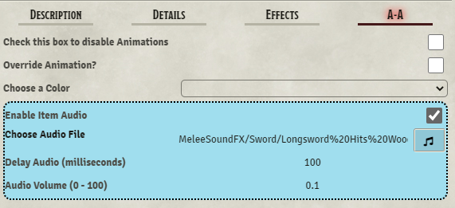

## NOTE: 0.5.0 now requires the SEQUENCER module as a dependency 
If you enjoy Automated Animations, consider sending some love on Patreon
### Patreon Link: https://www.patreon.com/otigon : Not required, but appreciated  

MIT License provided:  
- Code from Midi-QOL (Tim Posney) is used to check distance between tokens: Copyright (c) 2020 Tim Posney  
- Honeybadger (Trioderigon) provided the framework for the Misty Step Animation  
- The SEQUENCER module is now a dependancy of Automated Animations.  
Many thanks to WASP for creating a great animation framework with the SEQUENCER Module. Check out his website at https://app.fantasy-calendar.com/  
 
 

# Automated Animations
**No animations are provided in this module. It is designed to work in conjunction with the JB2A Animated Assets module. This module has been reviewed, approved and recommended by JB2A**  

I am not affiliated with JB2A, and am working on this only as a side project to make these great animation more easily accesible. 

Tutorial Video: https://www.youtube.com/watch?v=ZU2IbyEzias
## Available Animations ##
https://github.com/otigon/automated-jb2a-animations/blob/main/Animations/Available%20Animations.md  

# Introduction

At its core, Automated Animations is centered around the use of "instant" effects such as Weapon Attacks and Spell Effects. There are some areas that branch off from this concept and will be explained in the Wiki.

Current System Compatibility:  
- DnD 5e  
- Star Wars 5e
- DnD 3.5e
- PF1  
- PF2e  
- Shadow of the Demon Lord  
- Tormenta 20  
- Starfinder  
- Warhammer 4e
- Swade (WIP, it seems to broken atm)  

Systems in Process for Compatibility:   
- Please log a GitHub request for other systems  

REQUIRED MODULES: 
- **JB2A** - Jules&Ben's Animated Assets (patreon or free version)  
- **Sequencer** by Wasp

Optional Modules:
- Token Magic FX  
- Custom Token Animations by Kandashi (For Aura effects)  
- Socketlib (for placing Tile effects *see Wiki*)

Supported Modules for DnD5e (Those that mess with rolling):  
- CORE  
- MRE; Options to play animations on Attack or Damage  
- Midi-QOL; Options to play animations on Attack, Damage, Hit Targets, Check Saves for certain effects  
- Better Rolls; version 1.4.5 and above will play the animation on Attack Rolls through Better Rolls. I'll work on optional play on Damage Rolls for BR  
- Minimal Rolling Enhancements  
- Mars 5e  

## Roadmap (subject to change):  
     
1. Extending support to more systems  -- In Process
2. Adding customizable TMFX options on a per item basis (versus a global on/off setting currently)  
3. Adding "Summon" effects for spells/features  
4. Enhancing Item Sounds to use a wildcard feature  

# Overview
## Attack Spells and Melee attacks require a token(s) to be Targeted

As of release 0.5.0, Automated Animations has implemented the SEQUENCER module as a Dependancy. You can now think of A-A as a *lightweight* Sequence builder. For more customized animation sequences, use the the Sequencer module is highly recommended.   

Automated Animations reads the data passed through Chat Cards, or Module Hooks, to get the required information. Items (Spells, Weapons, etc) that have a **name** matching a **JB2A animation** will automatically play an animation on use. This generally occurs on the Attack Roll, with options for playing Animations on Damage Rolls. All **default** colors for available animations are based on the **Free** JB2A Module. To use color variants, you need to have the **Patreon** version of the JB2A Module.  
# Module Settings  
 
- **Disable the Startup Window Popup**: Prevents the Welcome Information from opening on start-up  
- **Global Delay**: Adds a user specified Delay to the start of ALL animations. Designated in milliseconds  
- **Animations Play ABOVE Overhead Tiles**: By default, animations are rendered BELOW any Overhead tiles. This makes for great depth on scenes.  
- **Autoplay Video Preview in A-A Tab**:  
-- **No Video Preview** (Default)  
-- **Manual Play**: Must click a play button to preview  
-- **Autoplay**: Video previews automatically play
- **Hide Animation Tab from Players**: Prevents Player access to the A-A Tab
- **Targeting Assistant**: Plays a "No Target" animation on the Source Token if there are no targets when an animation was expecting at least one  
- **Enable Token Magic FX**: Turns on integerated Token Magic Effects filters (Will change on a future update)  
- **Only play animations on Damage Rolls**: DEFAULT behavior plays animations on Attack Rolls  
  

**Midi-QOL ONLY Options** (Will expand on future updates)
- **Only Play Animations on Hits**: Will not play animations on misses  
- **Play Animations on Hits and Misses**: Midi-QOL ONLY option. Animations veer off-target on misses  
- **Critical Hit and Critical Miss**: Enables Crit Hit and Miss Animations (user specified via File Picker).  

# A-A Tab  

  

The **A-A** Tab on Item sheets allow users to customize colors (from the Patreon module), assign a different animation to the item, stop the animation from playing, and enable Sounds to play when the item is used.  

Item Names that are automatically Recognized will have the **COLOR** menu pre-populated with available color variants. This is where you will change the colors of the animation.  
  
Some items are automatically recognized, and will play animations by default. For ANY item that is automatically recognized or not, you can change/set the desired animation by checking the OVERRIDE button in the A-A Tab.  
  
Checking the **DISABLE** animation button will cause NO animation to play for those that are automatically recognized.  
  
  
  
To use a different animation, or to assign an animation to an Item that doesn't have one automatically play, **check** the **Override Animation** box. 

  

This enables an option to **Choose an Animation Type**. This menu is divided into several categories:  

## Melee Weapon  

Melee Animations such as Greataxe, Mace, Rapier etc. Some animations also have "Ranged" variants and will switch between the Melee and Ranged Animation depending on token position and other class features.  
- Dagger
- Handaxe
- Spear  
  
You can also use the following sub-options:  
- Divine Smite effect (Divine Smite on self and target are configureable)
- Explosion (Add explosive effects on hit)  
-- Explosion Sounds are configurable with this option
  
## Melee Damage  
  
Provides Generic Damage type animations (patreon ONLY), and the Unarmed Strike and Flurry of Blows animations  
  
  You can also use the following sub-options:  
- Divine Smite effect (Divine Smite on self and target are configureable)
- Explosion (Add explosive effects on hit)  
-- Explosion Sounds are configurable with this option
  
## Ranged Weapon 

Ranged Weapon animations such as Arrow, Boulder, Laser Shots, and a Throwing Hammer  
  
Using the "Arrow" Animation allows for choosing an Explosion Effect on arrow landing  
  
## Creature Attack  
  
Bite and Claw Animations  
  
## Attack Spells  
  
Contains all JB2A Attack Spell animations such as Fire Bolt, Guiding Bolt and Ray of Frost  
  
## Healing Spell
  
Contains the Cure Wounds and Generic Healing animations. Where available, variant options are provided  
  
## Explosives (Circle Template)  
  
Designed for use with items that have a Sphere, Cone, Circle type template (required). You can set the Variant, Radius and number of Loops for the animation.  
  
## Explosives (On Target)  
  
Causes an Explosion animation on the Targeted Token on item use  
  
## Explosives (Self)  
  
Intended for "Self Emanating" effects like Nova Explosions, Anti-Life Shell, etc. These will happen on the Source Token  
  
## Aura (REQUIRES the Custom Token Animations Module)  
  
Offers several JB2A Animations to be used as an Aura effect, and spawns a Dialog box that will delete the CTA aura effect when used. If you close (X) the dialog box unintentionally, you will need to delete the effect using the CTA panel.  
Gives the options to set the Radius, Animation Type, Tint, and Opacity (0.75 recommended)  
  
## Teleportation  
  
Currently only set for use with the Misty Step Animation. You can set the Range for the spawned guide template, and when used your token will teleport to whereever you LEFT click on the Canvas.  
  
## Class Features  
  
Specific for future expansion, but currently only contains the Bardic Inspiration animation. You can set Source and Target animations independantly as well as enabling **Marker** animations for Source and Target. MARKERS REQUIRE the CTA Module.  
  
## Breath Weapons  
  
Currently set for Line/Ray Templates, and assumes a 30 foot distance. This menu will be updated to encompass more Template types (Cones for example). You can choose the Animation Type and Color  
  
# Item Sounds  
  
  
  
A recent addition is the ability to play sounds when using items. When enabled, you can choose any Audio file and set the volume **(0.25 - 0.75 Recommended)**. The Audio Delay can be set in milliseconds to time the start of the Audio File with a particular animation.  
  
# Available Animations  
check the Animations.md (https://github.com/otigon/automated-jb2a-animations/blob/main/Animations/Available%20Animations.md) file for available animations and colors   

# Special Notes

1. Dagger, Handaxe and Spear animations. These 3 weapons have both melee and thrown animations. The module will read your distance to the target, and use the melee animation while in range, while switching to the thrown animation when out of melee range. It will also recognize the Bugbear race (DnD 5e) with their long limbs, to use Melee Animations when 10ft or less from the target. It will also check the weapon properties for "reach" if they can attack from further than one grid square distance.

2. Thunderwave: This spell has three different animations, and the module will choose which one to use based on where your Token is located **INSIDE** or **AROUND** the template. The image below shows possible token positions:  

  
  
  
# External Calls for Animations  
Other modules can now call animations through Automated Animations by using:  
**AutoAnimations.playAnimation(sourceToken, targets, item)**  
Parameters are as follows:
- sourceToken: The Token that is using the item  
- targets: passed as an Array
- item: the item that is being used  

**Please feel free to send suggestions or comments in the Suggestion Box of the JB2A discord, or log an issue on the GitHub page for issues or improvement suggestions.**

