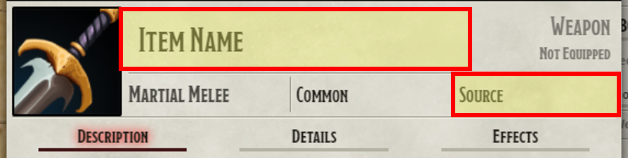
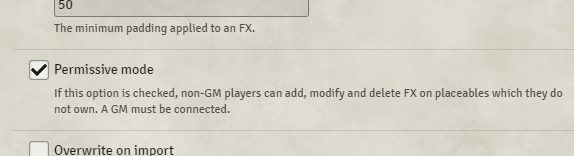
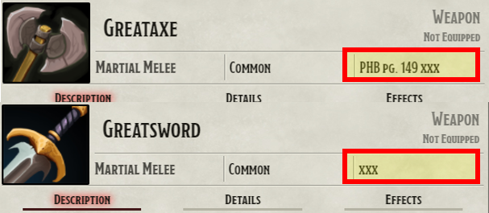
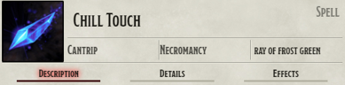

# Automated Animations
**No animations are provided in this module. It is designed to work in conjunction with the JB2A Animated Assets module. This module has been reviewed, approved and recommended by JB2A**  

I am not affiliated with JB2A, and am working on this only as a side project to make these great animation more easily accesible. 

Tutorial Video: https://www.youtube.com/watch?v=psYt4IdfIVI
## Quick Reference PDF ##
https://github.com/otigon/automated-jb2a-animations/blob/main/PDF/Keywords%20and%20Colors.pdf  

# Introduction

Time to ditch those animation macros! This module is designed to implement all of the "instant" duration animations like:

- Weapon Attacks
- Attack Spells
- Explosions
- Healing Spells

Currently implemented for **D&D 5e** and **PF1**, this module leverages the excellent animations from **JB2A**

REQUIRED MODULES: 
- **FXMaster**
- **JB2A** - Jules&Ben's Animated Assets (patreon and/or free version)  

Optional Modules:
- Token Magic FX

Supported Modules for 5e (Those that mess with rolling):
- CORE support now live!
- MRE; Options to play animations on Attack or Damage
- Midi-QOL; Options to play animations on Damage, Hit Targets, Check Saves for certain effects
- Better Rolls; SPECIAL CASE, Will need Midi-QOL Active for now to piggy back. I will look at pure Better Rolls Support soon

PF1 Support:
- Initial support for the PF1 system. There may be bugs that pop up, but let me know and I'll get on it to fix them

# Known Issues
- The **About Face** module can cause issues with the **FX Master** function used for the Melee attack animations. A fix has been proposed to the **FX Master** Author and it should be fixed on the next update for that module.

## Roadmap (subject to change):  
The first 3 are a higher priority, but the rest will flucuate depending on circumstances  
1. Adding Localization to support other languages  
2/3. Adding an Item Sheet Tab for better customization of animations (as opposed to manual input in Name/Source Fields). Handled through applying flags  
2/3. Extending support to PF2e, Star Wars and GURP  
4. Adding customizable TMFX options on a per item basis (versus a global on/off setting currently)
5. Ability to easily apply Sound FX in item customization settings via file picker
6. Adding more automatic recognition options (Spiritual Weapon Auto-Spawn & Delete, Reaction effects, Stuns, etc)  

# Overview
**Attack Spells and Melee attacks require a token(s) to be Targeted**

This module functions similarly to calling On-Use Macros through Midi-QOL or Item Macro. However, this will run all of the animations behind the scenes without fussing with macros. This is ONLY set up for DnD5e and PF1 currently, though may work on other similar systems.  

The module reads the data passed through Chat Cards to get the **Name** of the item, as well as reading the item's **Source** Field. It pairs animations from the JB2A module with items having the name they were designed for.

### Source Field is only available in the DnD5e System currently. I am working to add better customization fields based on Core Foundry to be used in other systems. For PF1, the best (current) way to change colors of effects is to add that color to the Name field

A good breakdown of what words the module looks for are in this reference PDF: https://github.com/otigon/automated-jb2a-animations/blob/main/PDF/Keywords%20and%20Colors.pdf

In this sense:
- a Greataxe will play the Greataxe animation
- a Longsword or Shortsword will play the Sword animation
- Fire Bolt will play the Fire Bolt animation
- Disintegrate will play the Disintegrate animation
- etc. etc. etc

The "default" animations used are the ones available in the Free version of JB2A. Their Patreon module has plenty of awesome color variants to use as well, and the color can be switched by adding the color you want (if available) in the **Source** field. (Check out **JB2A** on Patreon at https://www.patreon.com/JB2A)

Example: Fire Bolt  
Default Color: Orange  
Available Patreon Colors: Red, Blue, Green and Purple

Typing any one of the Patreon color options for Fire Bolt in the **Source** Field will change the animation played to that color variant.

# Settings

**1. Enable Token Magic FX**
- Token Magic FX for this Module is disabled by default. Enable this to activate the built in TMFX filters that play with the Animations.
- This is a module wide setting, but a future release will enable the options to disable the effects on a per animations basis.
- **If Enabled, it is recommended to have Permissive Mode enabled in the Token Magic FX Settings. This allows players to use the effects**  

**When the Animations Play**  
By default, the animations activate and play when the Midi-QOL "workflow" is complete. This means a few things:  
- If using MIDI to check for hits, the animations will play even if the attack misses and damage is not rolled.
- If NOT using Midi to check for hits, the animation will play when the Damage is rolled, but will also play on Nat 1's.

**2. Only play animations on Hits**
- If checking hits with Midi, you can enable this option to ONLY play animations when the target is hit by the attack

**3. Only play animations on Damage Rolls**
- A simpler option that will ONLY play animations when the Damage or Healing rolls are done.

# Using Animations for other Items or Spells

By default, the module will only recognize specific names of items to trigger the animations. To get around this there are a few options:

1. If you want to turn off an animation for a specific item, this can be done by typing **xxx** in the **Source** field. **NOTE** you do not need to delete any information currently in the **Source** field. Both examples below will bypass the animation.  
2. 

2. If you want to use an animation for an item that doesn't have one, simply put the animation/item name you want to use in the **Source** Field. In the example below, there is no animation currently for Chill Touch, but the Green Ray of Frost animation works nicely. By putting Ray of Frost Green (CAPS is not necessary) in the **Source** Field, this item will now call the Green Ray of Frost animation.  
3. 

# Special Notes

1. Dagger, Handaxe and Spear animations. These 3 weapons have both melee and thrown properties. The module will read your distance to the target, and use the melee animation while in range, while switching to the thrown animation when out of melee range. It will also recognize the Bugbear race with their long limbs, to use Melee Animations when 10ft or less from the target.  

You can still set the color of the **Melee** weapon animation in the Source Field, but the thrown weapons do not have color variants (yet), so they will stay at the standard animation.  

2. Thunderwave: This spell has three different animations, and the module will choose which one to use based on where your Token is located **INSIDE** or **AROUND** the template. The image below shows possible token positions:  

**Please feel free to send suggestions or comments in the Suggestion Box of the JB2A discord, or log an issue on the GitHub page for issues or improvement suggestions.**

