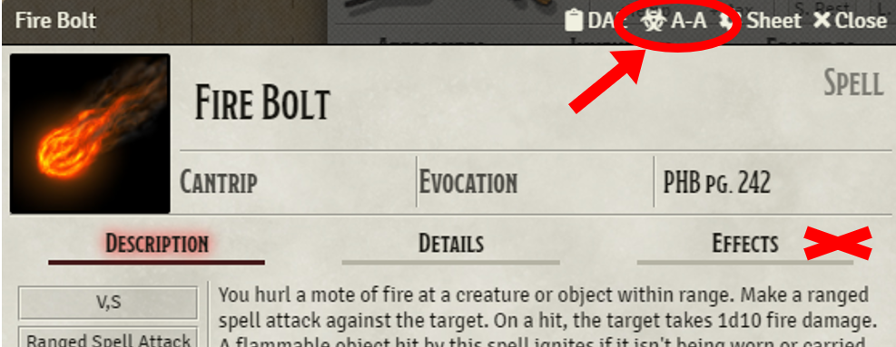
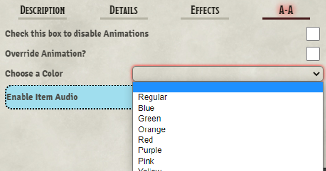
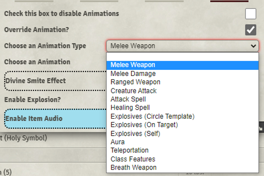
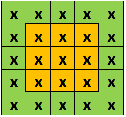

## NOTE: Use of the Source Field (in DnD 5e) has been deprecated. Moving forward only the Animate Tab will be supported and updated  

# Automated Animations
**No animations are provided in this module. It is designed to work in conjunction with the JB2A Animated Assets module. This module has been reviewed, approved and recommended by JB2A**  

I am not affiliated with JB2A, and am working on this only as a side project to make these great animation more easily accesible. 

Tutorial Video: https://www.youtube.com/watch?v=psYt4IdfIVI
## Quick Reference PDF ##
https://github.com/otigon/automated-jb2a-animations/blob/main/PDF/Keywords%20and%20Colors.pdf  

# Introduction

Time to ditch those animation macros! This module is designed to implement all of the "instant" duration animations like:

- Weapon Attacks
- Attack Spells
- Explosions
- Healing Spells

Currently implemented for **D&D 5e** and **PF1**, this module leverages the excellent animations from **JB2A**

REQUIRED MODULES: 
- **FXMaster**
- **JB2A** - Jules&Ben's Animated Assets (patreon and/or free version)  

Optional Modules:
- Token Magic FX

Supported Modules for 5e (Those that mess with rolling):
- CORE support now live!
- MRE; Options to play animations on Attack or Damage
- Midi-QOL; Options to play animations on Damage, Hit Targets, Check Saves for certain effects
- Better Rolls; SPECIAL CASE, Will need Midi-QOL Active for now to piggy back. I will look at pure Better Rolls Support soon

PF1 Support:
- Initial support for the PF1 system. There may be bugs that pop up, but let me know and I'll get on it to fix them

# Known Issues
- The **About Face** module can cause issues with the **FX Master** function used for the Melee attack animations. A fix has been proposed to the **FX Master** Author and it should be fixed on the next update for that module.

## Roadmap (subject to change):  
    
1. Adding Localization to support other languages   
2. Extending support to PF2e, Star Wars, GURP and SWADE  
4. Adding customizable TMFX options on a per item basis (versus a global on/off setting currently)
5. Ability to easily apply Sound FX in item customization settings
6. Adding more automatic recognition options (Spiritual Weapon Auto-Spawn & Delete, Reaction effects, Stuns, etc)  

# Overview
## Attack Spells and Melee attacks require a token(s) to be Targeted

This module functions similarly to calling On-Use Macros through Midi-QOL or Item Macro. However, this will run all of the animations behind the scenes without fussing with macros. This is ONLY set up for DnD5e and PF1 currently, though may work on other similar systems. System expansion will be in the works soon (see roadmap above) 

Automated Animations reads the data passed through Chat Cards, or Module Hooks, to get the **Name** of the item. Items (Spells, Weapons, etc) that have a **name** matching a **JB2A animation** will play an animation on use. This generally occurs on the Attack Roll, with options for playing Animations on Damage Rolls. All **default** colors for available animations are based on the **Free** JB2A Module. To use color variants, you need to have the **Patreon** version of the JB2A Module.

# Animate Tab  

  

The **Animate** Tab on Item sheets allows users to customize colors (from the Patreon module), assign a different animation to the item, or stop the animation from playing altogether.  

Item Names that are automatically Recognized will have the **COLOR** menu pre-populated with available color variants. This is where you will change the colors of the animation.  
  
  
  
To use a different animation, or to assign an animation to an Item that doesn't have one automatically play, **check** the **Override Animation** box. 

  

This enables an option to **Choose an Animation Type**. This menu is divided into several categories:  
- Melee Weapon  
- Generic Melee Damage  
- Ranged Weapon  
- Creature Attack  
- Attack Spell  
- Healing Spell  
- Explosives (Template)  
- Explosives (Target)  

# Available Animations  
check the Animations.md file for available animations and colors  
## Special Notes  
**Explosives (Template)**  
For use with Spells/Items that use a Circular Template. This will play an explosion animation at the center of a circular template when placed on the canvas.  
**Explosives (Target)**  
Designed for use with **thrown items** like Alchemist's Fire to play an explosion directly on the targetted token.  

# Settings

**1. Enable Token Magic FX**
- Token Magic FX for this Module is disabled by default. Enable this to activate the built in TMFX filters that play with the Animations.
- This is a world setting, but a future release will enable the options to disable the effects on a per animations basis.

**When the Animations Play**  
**MIDI-QOL**  
By default, the animations activate and play when the Midi-QOL "workflow" is complete. This means a few things:  
- If using MIDI to check for hits, the animations will play even if the attack misses and damage is not rolled.
- If NOT using Midi to check for hits, the animation will play when the Damage is rolled, but will also play on Nat 1's.

**2. Only play animations on Hits**
- If checking hits with Midi, you can enable this option to ONLY play animations when the target is hit by the attack

**3. Only play animations on Damage Rolls**
- A simpler option that will ONLY play animations when the Damage or Healing rolls are done.

**Core 5e, MRE**  
By Default, animations will play on Attack Rolls. Setting is available to play animations on **Damage Rolls** only.

# Special Notes

1. Dagger, Handaxe and Spear animations. These 3 weapons have both melee and thrown animations. The module will read your distance to the target, and use the melee animation while in range, while switching to the thrown animation when out of melee range. It will also recognize the Bugbear race (DnD 5e) with their long limbs, to use Melee Animations when 10ft or less from the target. It will also check the weapon properties for "reach" if they can attack from further than one grid square distance.

2. Thunderwave: This spell has three different animations, and the module will choose which one to use based on where your Token is located **INSIDE** or **AROUND** the template. The image below shows possible token positions:  

**Please feel free to send suggestions or comments in the Suggestion Box of the JB2A discord, or log an issue on the GitHub page for issues or improvement suggestions.**

